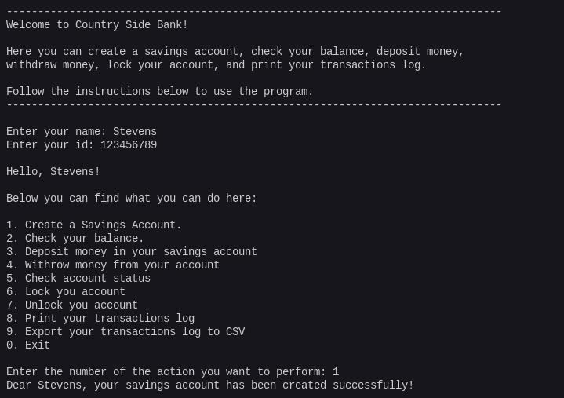

# Country Side Bank Program

## Description

Welcome to Country Side Bank! This program is designed to provide users with various self-service options related to their savings account. Users can perform a range of actions such as creating a savings account, checking their balance, depositing money, withdrawing money, checking account status, locking and unlocking their account, and printing their transactions log.

## Options

To interact with the program, follow the instructions below:

1. **Create a Savings Account**: Start by creating a new savings account.
2. **Check Your Balance**: View the current balance in your savings account.
3. **Deposit Money**: Add funds to your savings account.
4. **Withdraw Money**: Remove funds from your account.
5. **Check Account Status**: Verify the status of your account.
6. **Lock Your Account**: Securely lock your account for added protection.
7. **Unlock Your Account**: Unlock your account when needed.
8. **Print Transactions Log**: Obtain a printed record of your account transactions.
9. **Export Transactions to CSV**: Save your transactions log in CSV format.

0. **Exit**: Close the program.

Follow the on-screen instructions to navigate through these options and manage your Country Side Bank savings account.

## Screenshot

